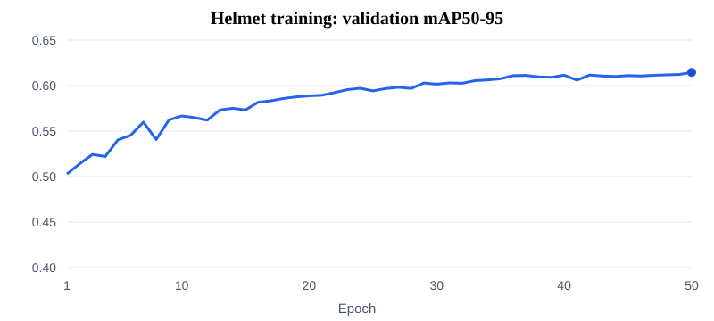
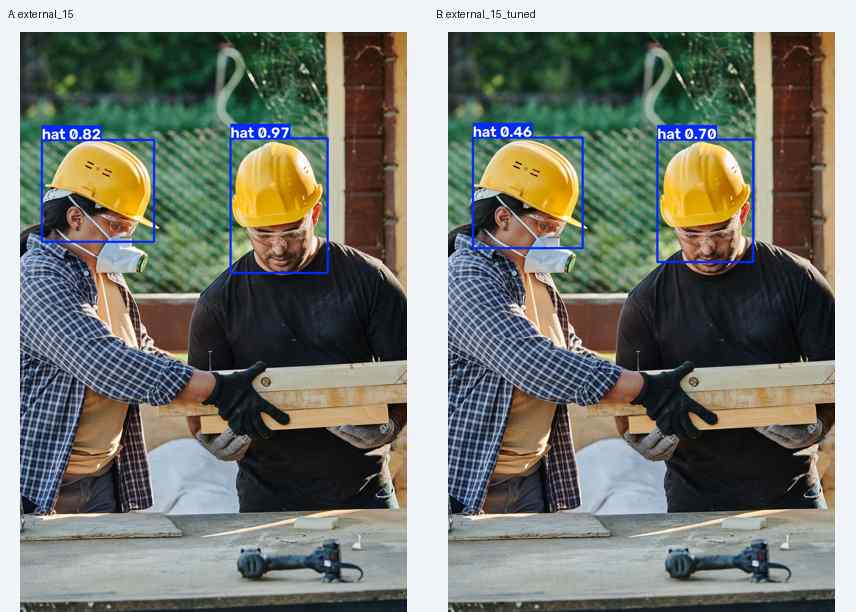
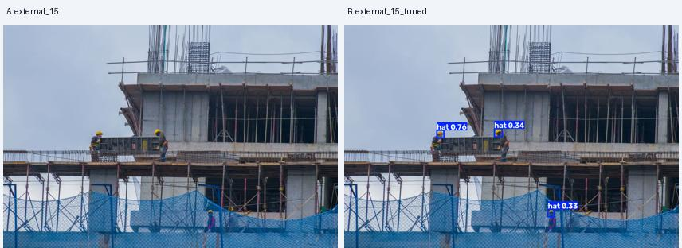
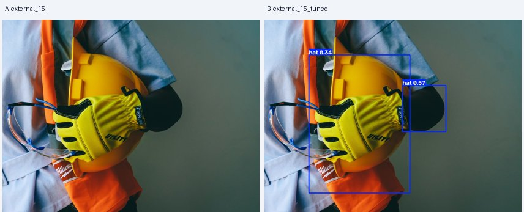

# YOLOv8 安全帽目标检测学习项目

使用 [Ultralytics YOLOv8](https://docs.ultralytics.com/models/yolov8/) 与 [SHWD 数据集](https://github.com/njvisionpower/Safety-Helmet-Wearing-Dataset)，在 Mac 上完成数据转换、训练、保留测试集评价和外部照片预测。这里记录复现过程与真实结果，不是 YOLOv8 算法的原创实现。

**更新于 2026-10-10：** 已整理 1 / 5 / 50 轮训练记录，重新评价现有 best.pt 的 759 张测试集，并加入 15 张外部照片的两组预测展示。尚未完成严格控制变量的模型大小、输入尺寸对比。

## 1. 数据与类别

本地划分：**训练 6,064 张 / 验证 758 张 / 测试 759 张**。原始目录名为 `VOC2028`，数据来源是 SHWD。

| 类别 | 含义 |
| --- | --- |
| `hat`（0） | 戴安全帽的头部目标 |
| `person`（1） | 未戴安全帽的头部目标；不是整个人体 |

外部 15 张照片来自 Pexels，包括近景、多人、脚手架、遮挡、手持安全帽等场景。它们没有人工标签，只用于观察检测效果，不能计作有标注的测试集。

## 2. 训练与验证记录

以下数值来自各次训练日志的**最后一轮验证**。设置为 YOLOv8n、imgsz 640、batch 4、seed 0、Apple MPS。

| 本地运行名 | 轮数 | Precision | Recall | mAP50 | mAP50-95 |
| --- | ---: | ---: | ---: | ---: | ---: |
| `helmet_try` | 1 | 0.7946 | 0.6938 | 0.7751 | 0.4413 |
| `helmet_test` | 5 | 0.9082 | 0.8274 | 0.8950 | 0.5620 |
| `helmet_50` | 50 | 0.9444 | 0.8790 | 0.9344 | 0.6145 |

`helmet_test` 是运行名称，这一行仍然是验证结果。`helmet_50/args.yaml` 记录了从 `last.pt` 恢复训练，因此这张表是已有训练过程的汇总，不能当作三组独立、从零开始的严格对比实验。



[运行摘要](reports/helmet_runs.csv) · [50 轮逐轮记录](reports/helmet_50_history.csv) · [三次训练的完整数值与配置](reports/training/)（仅把本机绝对路径改为相对路径）

## 3. 759 张测试集成绩

2026-10-10 使用本机已有的 `runs/helmet_50/weights/best.pt` **重新评价，没有重新训练**。运行设备为 CPU，imgsz 640、batch 4；测试集含 12,601 个标注目标。

| 范围 | Precision | Recall | mAP50 | mAP50-95 |
| --- | ---: | ---: | ---: | ---: |
| 全部类别 | 0.9100 | 0.8508 | **0.9119** | **0.5709** |
| hat | 0.9012 | 0.8257 | 0.8965 | 0.6708 |
| person | 0.9189 | 0.8759 | 0.9274 | 0.4709 |

这是保留测试划分上的成绩，与上一节最后一轮验证成绩的模型选择和数据不同，不应直接混为一组。mAP50 是 IoU=0.50 时的平均精度；mAP50-95 使用更严格的多档 IoU。二者都不等于“预测正确图片的比例”。

[完整数值、软件版本与权重 SHA256](reports/test_metrics.json) · [759 张图片名称与标签校验值](reports/test_manifest.csv)

当前环境记录为 Python 3.14.7 / PyTorch 2.14.0 / Ultralytics 8.4.164。历史训练使用 MPS，本次测试使用 CPU。测试成绩只能说明这一划分下的表现，不能保证新工地场景的效果。

## 4. 外部照片：效果与局限

已有目录 `external_15` 和 `external_15_tuned` 各保存了 15 张画框图。以下左侧为 A（external_15），右侧为 B（external_15_tuned）。**旧输出未完整保存命令、阈值和权重身份**，目录名中的 tuned 不代表已证明改进；这里只展示已有输出。

| 场景 | 两组已有输出 |
| --- | --- |
| 多人近景：[Pexels 8961623](https://www.pexels.com/photo/8961623/) |  |
| 远处与遮挡：[Pexels 13795569](https://www.pexels.com/photo/13795569/) |  |
| 手持安全帽：[Pexels 8487720](https://www.pexels.com/photo/8487720/) |  |

可以观察到：近景戴帽头部能被检出；远处小目标在两组图中的检出情况不同；手持安全帽和背景区域也可能被标为 hat。对“戴帽头部”任务，这些是需要进一步人工核对的误检候选。降低阈值或改变尺寸可能同时增加检出和误检，不能只凭画框数量判断效果。

[查看全部 15 张对照及逐图来源](reports/external_gallery.md) · [照片来源清单](helmet_external_test/photo_sources.csv) · [30 张原始画框文件校验清单](reports/external_outputs.csv)

页面预览经过缩小压缩，完整图片保留在本机；没有把 SHWD 原始数据公开到仓库。新增预测入口以后会保存 `command.json` 和 `environment.json`，便于追溯参数。

## 5. 从安装到预测、训练、测试

在仓库根目录创建环境并安装依赖：

```bash
python3 -m venv .venv
source .venv/bin/activate
python -m pip install -r requirements.txt
python run.py check
python run.py predict
```

Windows CMD 用 `.venv\Scripts\activate.bat` 激活。设备会自动选择 CUDA、MPS 或 CPU；可用 `--device cpu` 指定设备。`requirements.txt` 是安装清单，不是文件夹；它放在仓库根目录。当前依赖使用版本范围，若要尽量复现历史成绩，还需要匹配上述环境、数据划分和训练恢复过程。

从 SHWD 原仓库取得有使用权限的数据，目录应为：

```text
VOC2028/
  Annotations/    # XML 标注
  JPEGImages/     # 图片
```

```bash
python voc_to_yolo.py
python split_dataset.py
python train_helmet.py
python test_helmet.py
```

转换脚本写入 `VOC2028/labels/`；划分脚本按固定随机种子生成 `helmet_dataset/` 和 `data.yaml`，发现输出已存在时停止，避免覆盖旧划分。训练入口从官方 YOLOv8n 预训练权重开始新的 50 轮训练，不会自动恢复历史训练。结果目录若已存在会递增；测试默认使用 `runs/helmet_50/weights/best.pt`，若训练生成了新目录，要显式传入对应权重：

```bash
python test_helmet.py --model runs/helmet_502/weights/best.pt
```

测试会生成评价图、`metrics.json`、`command.json` 和 `environment.json`。仓库没有附带模型权重，运行测试前要先训练，或把本机已有权重放回对应目录。

下载外部照片并预测：

```bash
python helmet_external_test/download_images.py
python predict_external.py --conf 0.25 --imgsz 640
```

这个命令用于生成**新的有参数记录的预测**，不声称复现旧的两组图片。照片下载失败时可按来源清单从原页面获取；不应关闭 HTTPS 证书验证。

## 6. 代码如何工作

| 文件 | 读取什么 → 做什么 → 生成什么 |
| --- | --- |
| `requirements.txt` | 告诉 pip 安装哪些库；Ultralytics 提供模型和训练 API |
| `run.py` | 读取命令参数，选择设备，调用 YOLO 的 predict / train / val，保存结果和运行记录 |
| `voc_to_yolo.py` | 读取 XML 的类别与像素坐标，转成归一化的 `类别 中心x 中心y 宽 高` TXT |
| `split_dataset.py` | 检查图片与标签对应关系，固定随机种子划分三组数据，生成 YAML |
| `train_helmet.py` | 加载 yolov8n.pt，以安全帽数据微调模型，保存 best.pt / last.pt |
| `test_helmet.py` | 使用已训练权重和 test 划分评价；复用 run.py 的保存逻辑 |
| `predict_external.py` | 使用已训练权重对外部照片逐张画框；复用 run.py 的参数记录 |
| `helmet_external_test/download_images.py` | 按固定 15 个 Pexels 编号下载照片，生成来源清单 |
| `reports/` | 保存指标、历史配置、训练曲线与展示说明 |
| `experiments.csv` | 区分已完成、定性观察和待做的对比实验 |

公交车预测与 COCO8 三轮训练已在本机跑通，只用于检查流程，不计入安全帽成绩。

## 7. 下一步实验

- 在同一数据划分、训练预算和硬件下对比 YOLOv8n / YOLOv8s，或者只改变输入尺寸；计划见 `experiments.csv`。
- 为外部照片补充人工框，统计误检与漏检；调参后需要新的独立照片再检验。
- 补充多次随机种子实验，报告波动，避免把单次结果当作稳定结论。

## 来源与许可

模型、预训练权重和训练 API 来自 [Ultralytics 官方项目](https://github.com/ultralytics/ultralytics)，请遵守其 [AGPL-3.0 / Enterprise 许可说明](https://www.ultralytics.com/license)。本项目脚本是在官方 API 上编写和整理的学习代码。

数据来自 [njvisionpower/SHWD](https://github.com/njvisionpower/Safety-Helmet-Wearing-Dataset)。原仓库标有 MIT 许可，同时说明部分图像来自网络和 SCUT-HEAD；代码许可不自动等于所有图片的再分发授权，因此本仓库不发布原始数据集。

外部照片来自 Pexels，逐张链接见来源清单，使用遵循 [Pexels License](https://www.pexels.com/license/)。画框仅是模型输出，不表示照片人物的真实安全状态，也不暗示摄影者或人物为项目背书。
