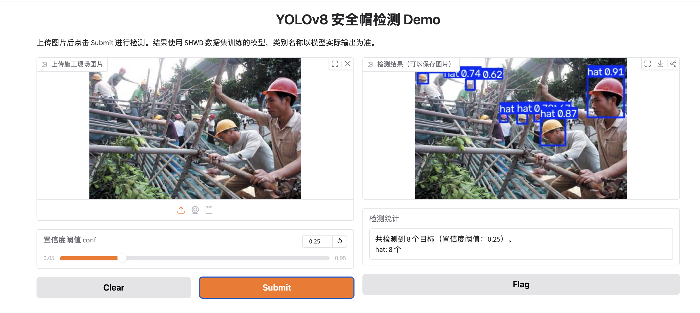
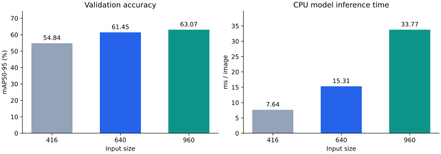

# YOLOv8 Helmet Detection with Gradio

[中文](README.md) · [Model](models/README.md) · [Experiments](reports/size_comparison.md) · [Failure cases](reports/failure_cases.md)

A learning and reproduction project using **Ultralytics YOLOv8n and SHWD**: data conversion, training, held-out evaluation, input-size comparison, and a local Gradio image demo. This is an application of YOLOv8, not an original detector architecture.



The user-provided screenshot shows 8 predicted hat targets at conf=0.25. It demonstrates the interface; the image's training-set membership has not been verified, so it is not independent evaluation evidence. No hosted public demo is currently deployed.

## Try it without retraining

Clone or download the repository, then:

```bash
git clone https://github.com/CJ2323232/yolov8-learning.git
cd yolov8-learning
python3 -m venv .venv
source .venv/bin/activate
python -m pip install -r requirements-gradio.txt
python download_weights.py
python app.py
```

On Windows CMD use `python -m venv .venv` and `.venv\Scripts\activate.bat`. Open the URL printed in the terminal, usually `http://127.0.0.1:7860`. Upload one image, set conf, click Submit, then view/download the annotated image and read class counts. Keep the terminal running; stop with Control+C.

The model is included at `models/helmet_yolov8n.pt` (6,230,058 bytes). The helper verifies SHA256 and installs it at the default inference path without replacing a different existing checkpoint. [Direct model download](https://raw.githubusercontent.com/CJ2323232/yolov8-learning/main/models/helmet_yolov8n.pt).

For later launches, run `./.venv/bin/python app.py`; Windows: `.venv\Scripts\python.exe app.py`. Mac users can use `启动安全帽检测.command`; after a ZIP download, restore its execute permission if necessary. A different checkpoint can be selected with `YOLO_MODEL_PATH`. Device selection is automatic: MPS / CUDA / CPU.

## Data and results

SHWD local split: **6,064 train / 758 validation / 759 test images**. `hat` means a helmet-wearing head; `person` means a bare/unhelmeted head, not a full-body person. Original dataset images are not bundled.

The existing 50-epoch run's best checkpoint was re-evaluated on the held-out test split on 2026-10-10, with CPU / imgsz 640 / batch 4:

| Precision | Recall | mAP50 | mAP50-95 |
| ---: | ---: | ---: | ---: |
| 0.9100 | 0.8508 | 0.9119 | 0.5709 |

[Metrics and checkpoint identity](reports/test_metrics.json) · [Test manifest](reports/test_manifest.csv)

An input-size comparison on 2026-10-11 used the same checkpoint and the same 758 validation images, with no retraining:

| imgsz | mAP50 | mAP50-95 | CPU inference ms/image |
| ---: | ---: | ---: | ---: |
| 416 | 0.8611 | 0.5484 | 7.64 |
| 640 | 0.9343 | 0.6145 | 15.31 |
| 960 | 0.9526 | 0.6307 | 33.77 |



960 improved validation mAP50-95 by about 1.62 percentage points over 640, with about 2.2 times the CPU model inference time in this run. Timing excludes preprocessing, postprocessing and the UI. Each size was evaluated once in fixed order; timings are exploratory, not a stable hardware benchmark. This experiment does not separately measure small-object AP.

[Full conditions and raw results](reports/size_comparison.json) · [CSV](reports/size_comparison.csv) · [Validation manifest](reports/validation_manifest.csv)

Reproduce with prepared SHWD validation data:

```bash
python benchmark_sizes.py --data helmet_dataset/data.yaml --sizes 416 640 960 --device cpu --output reports/my_size_comparison
```

Historical 1/5/50-epoch figures are last-epoch validation results. The 50-epoch configuration records resumed training; these are not three independent from-scratch controlled experiments. The 15 external Pexels images have no ground-truth boxes and support qualitative observations only.

## Limitations

A helmet lying on the ground can be incorrectly classified as a helmet-wearing head. Small, occluded and blurred heads need more careful annotation and evaluation. The system is not certified for safety decisions. [Fresh failure/boundary predictions](reports/failure_cases.md) include source links and exact parameters; old tuned outputs lack full parameter provenance.

The demo supports one image at a time. Video, batch uploads, hosted inference, repeated timing trials and model-size retraining comparisons remain future work.

## Code and environment

`app.py`: Gradio UI; `download_weights.py`: verified model setup; `run.py`: check/predict/train/val; `voc_to_yolo.py` and `split_dataset.py`: preprocessing; `train_helmet.py` / `test_helmet.py`: training/evaluation; `benchmark_sizes.py`: input-size comparison; `predict_external.py`: recorded external inference.

Verified local environment: Python 3.14.7, torch 2.14.0, Ultralytics 8.4.164, Gradio 6.30.0. Historical training used MPS; the published new evaluation/comparison used CPU. Results and latency can vary across environments. [Detailed workflow (Chinese)](docs/WORKFLOW.md).

## Credits and terms

Models and APIs: [Ultralytics](https://github.com/ultralytics/ultralytics), subject to its [AGPL-3.0 / Enterprise terms](https://www.ultralytics.com/license). UI: [Gradio](https://github.com/gradio-app/gradio). Dataset: [SHWD](https://github.com/njvisionpower/Safety-Helmet-Wearing-Dataset). Its repository is MIT-licensed but images include web and SCUT-HEAD sources; the original dataset is not redistributed here. External examples follow the [Pexels License](https://www.pexels.com/license/), with per-image credits. Model predictions are not claims about the subjects' real safety status or endorsement.
