# 15 张外部照片：已有两组预测输出

A：`external_15`；B：`external_15_tuned`。这里只对照已有图片；原始参数和模型身份没有完整保存，不能认定 B 更好。照片无人工检测框，无法计算 Precision、Recall 或 mAP。预览经过等比例缩小与 JPEG 压缩，原始画框输出留在本机。

## 01 · 近景黄色安全帽
照片来源：[Pexels 8960993](https://www.pexels.com/photo/8960993/)

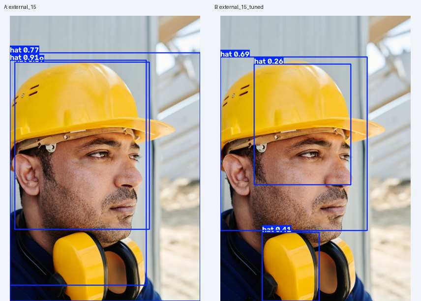

## 02 · 单人施工场景
照片来源：[Pexels 30411827](https://www.pexels.com/photo/30411827/)

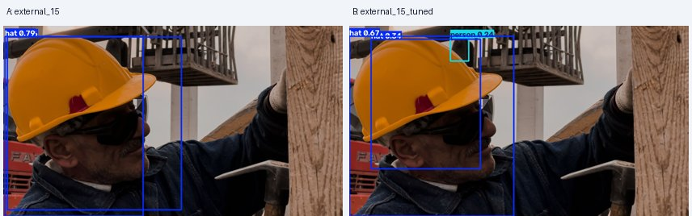

## 03 · 多人施工场景
照片来源：[Pexels 8961623](https://www.pexels.com/photo/8961623/)

## 04 · 钢筋背景多人
照片来源：[Pexels 10202856](https://www.pexels.com/photo/10202856/)

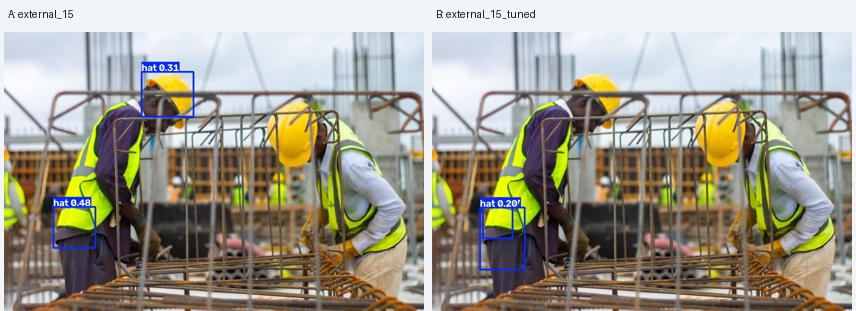

## 05 · 脚手架
照片来源：[Pexels 13963338](https://www.pexels.com/photo/13963338/)

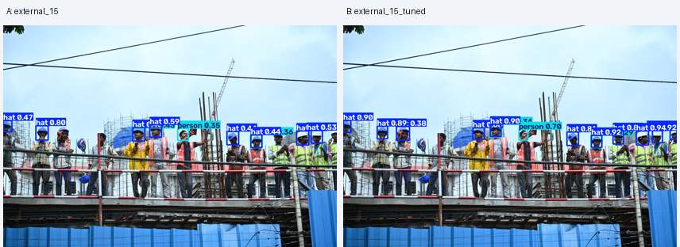

## 06 · 复杂脚手架与遮挡
照片来源：[Pexels 13795569](https://www.pexels.com/photo/13795569/)

## 07 · 局部遮挡
照片来源：[Pexels 28663713](https://www.pexels.com/photo/28663713/)

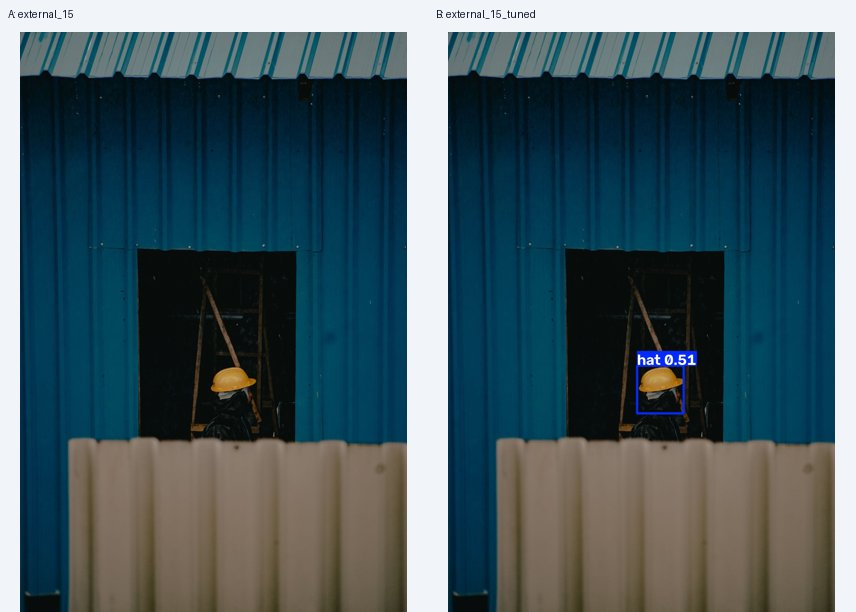

## 08 · 远距离行走
照片来源：[Pexels 16368435](https://www.pexels.com/photo/16368435/)

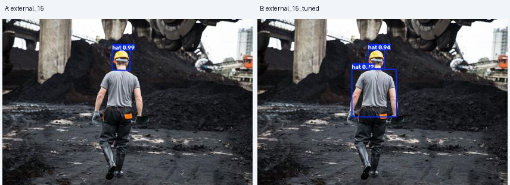

## 09 · 木结构施工
照片来源：[Pexels 8961526](https://www.pexels.com/photo/8961526/)

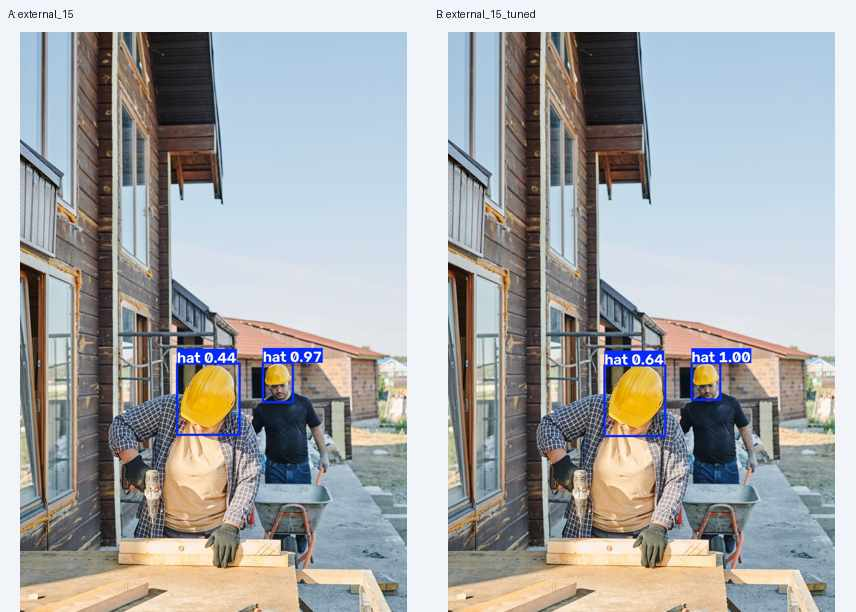

## 10 · 室内施工
照片来源：[Pexels 5493673](https://www.pexels.com/photo/5493673/)

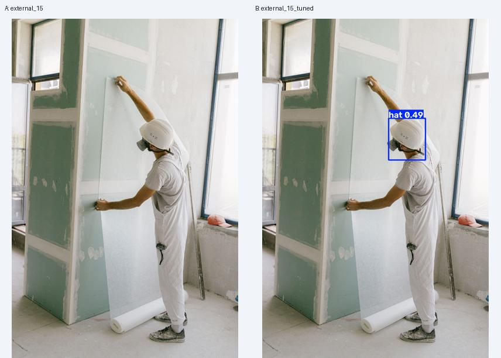

## 11 · 人物姿态变化
照片来源：[Pexels 8487409](https://www.pexels.com/photo/8487409/)

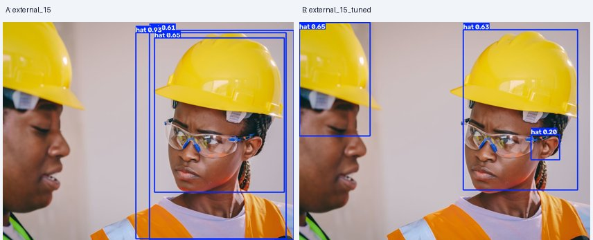

## 12 · 天空背景
照片来源：[Pexels 32467388](https://www.pexels.com/photo/32467388/)

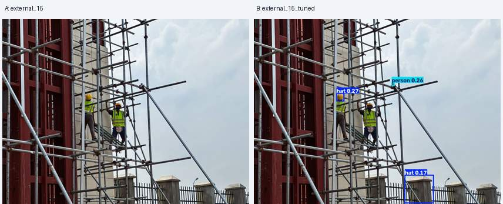

## 13 · 黑白场景
照片来源：[Pexels 10555726](https://www.pexels.com/photo/10555726/)

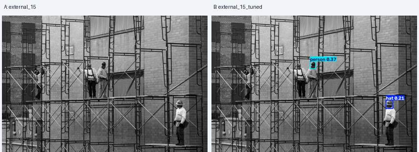

## 14 · 手持安全帽
照片来源：[Pexels 8487720](https://www.pexels.com/photo/8487720/)

## 15 · 独立安全帽
照片来源：[Pexels 30592246](https://www.pexels.com/photo/30592246/)

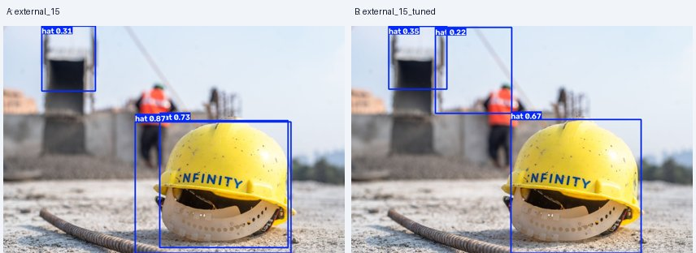
