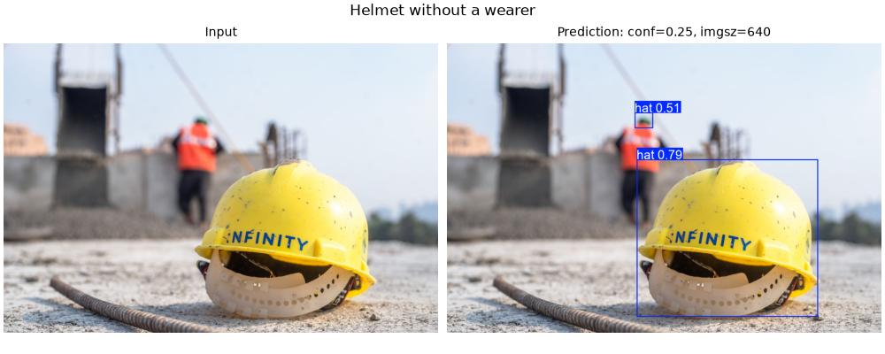
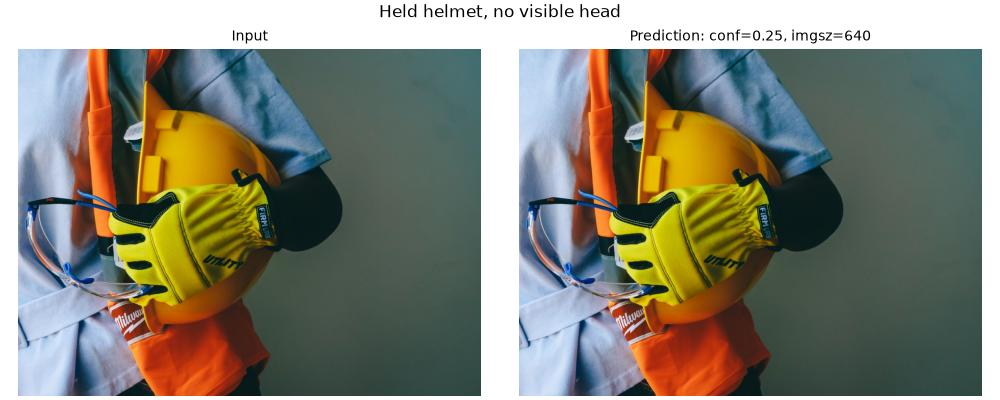
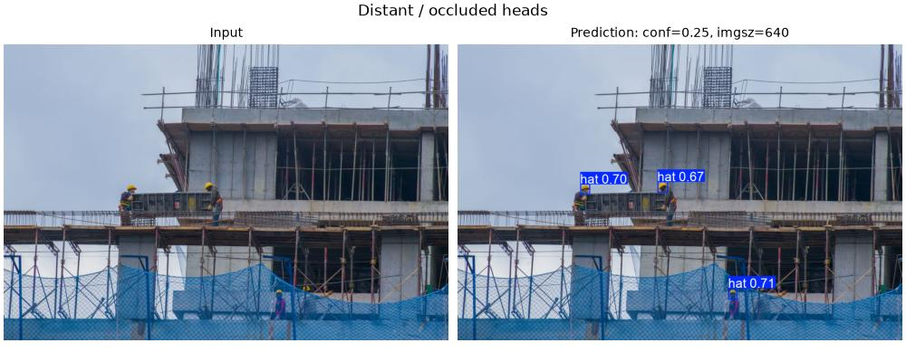

# 失败与边界案例

以下是 2026-10-11 **新运行的预测**，不是旧 external_15_tuned 的参数推测。使用公开的同一个 best.pt，CPU / imgsz=640 / conf=0.25。任务目标是戴帽或未戴帽的头部，不是检测任意安全帽物体。

## 1. 明确的任务边界错误：地上的安全帽

前景安全帽没有佩戴者，却被输出为 hat，置信度约 0.79；这是相对于“戴帽头部”任务的误检。背景另有约 0.51 的小框，其人物状态和目标边界需人工核对，不能凭低清预览判断对错。

可能原因是模型使用了帽子外观特征，缺少头部与佩戴关系约束；这是待验证的解释，不是已证明的内部机制。可尝试增加无人佩戴安全帽的负样本，或显式建模头部与安全帽关系，再用独立数据验证。

来源：[Pexels 30592246](https://www.pexels.com/photo/30592246/)。

## 2. 负例对照：手持安全帽

图片没有可见头部，本次输出 0 个框，是这张图片上期望的行为。旧 tuned 输出曾出现 hat 框，但旧权重和参数未完整保存，不能把两次变化归因于某个参数，也不能据此声称模型已解决全部手持安全帽误检。

来源：[Pexels 8487720](https://www.pexels.com/photo/8487720/)。

## 3. 挑战场景：远处小目标与遮挡

本次输出 3 个 hat 框。预览可以说明模型在远处目标上的输出形态，但没有人工真值框，不能把 3 个框写成“全部检出”，也不能计算漏检率。下一步应先人工标注可辨认头部，再按目标尺寸和遮挡程度统计 Precision / Recall。

来源：[Pexels 13795569](https://www.pexels.com/photo/13795569/)。

## 后续验证方法

先明确标注规范：只标头部，戴帽与未戴帽分别归类，独立或手持安全帽作为负例。把用于调参的照片与最终验证照片分开；在固定模型、输入尺寸和 conf 下记录 TP / FP / FN。修改数据或模型后重新评价，报告改善和退化，不仅挑选成功图片。

[本次预测框、置信度和坐标](failure_predictions.json) · [历史 15 张定性对照](external_gallery.md)
